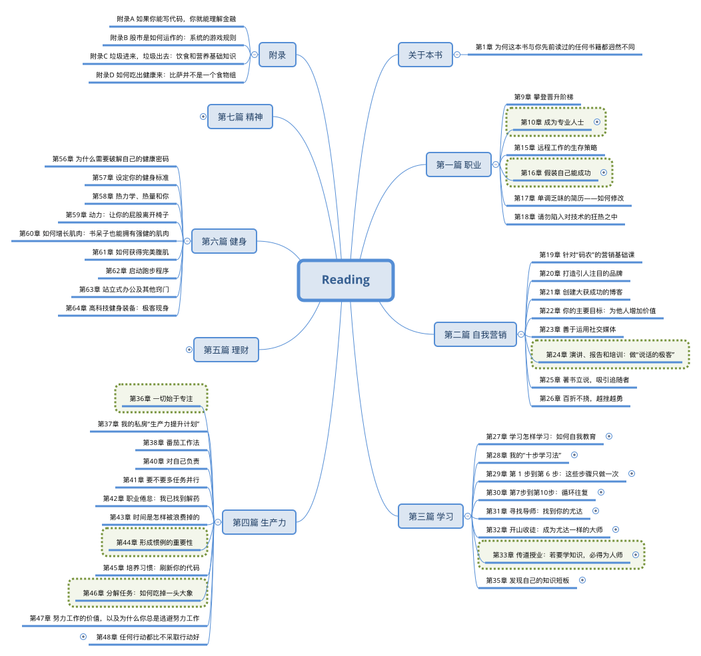
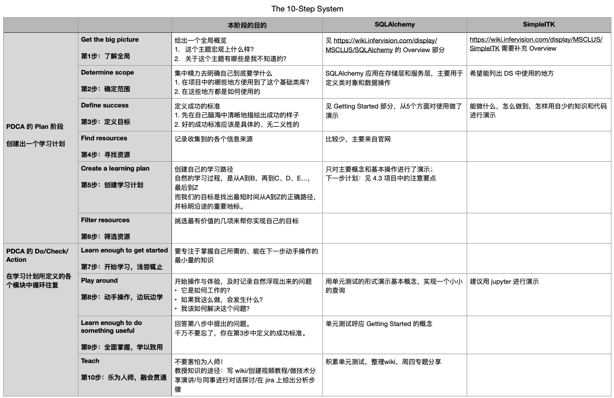

% 十步学习法
% lyan
% 2021-02-24

## 一本书

### 《软技能：代码之外的生存指南》

- Soft Skills: The Software Developer's Life Manual
  - By John Sonmez / Originally published: 2014
- 全面讲解软件行业从业人员所需知道的所有“软技能”
  - 职业篇
  - 自我营销篇
  - 学习篇
  - 生产力篇
  - 理财篇
  - 健身篇
  - 精神篇

### Overview

<!--  -->

### 学习篇

- 如何快速掌握新技术的十步学习法
- 如何寻找导师？
- 如何指导别人？
- 如何持续学习？

### 10 Steps To Learn Anything Quickly

- 10 Steps To Learn Anything Quickly # 收费的 training
  - <https://simpleprogrammer.com/products/learn-anything-quickly/>
  - How It Works
    - the first 6 steps
      - 了解主题的广度和范围/避免未知之未知/定制专属你的行动计划
    - the last 4 steps
      - 以史无前例的速度完成行动计划/在 n 年之后依然能够快速的输出

### More to learn

- Honestly Evaluating Your Skills # 技能评估的一般方法
  - <https://simpleprogrammer.com/honestly-evaluating-your-skills/>
  - honest answers shape your career in the way that you want
- The Simple Programmer Soft Skills Quiz # 软技能自测
  - <https://simpleprogrammer.com/the-simple-programmer-soft-skills-quiz/>
- <http://wiki.li3huo.com/book/Soft_Skills>

## 方法背后的逻辑

### 1. The breadth of the subject

- 总体格局--消除未知的未知
  - 它的历史以及它的主要用途；
  - 它的所有结构和特性——特别是独有的特性；
  - 它包含的各种类型的标准库，以及这些库所涵盖的内容以及你可以使用它们做什么。

### 2. How to get started

- 如何开始--让入门变得不那么苦不堪言
  - 提供一个检出后能简便的运行的程序 -- pytest
  - 一键安装
  - 一键运行并显示结果

### 3. The basics

- 提炼出关键的内容-践行“二八原则”
  - 收集用户案例和最常见的问题
  - 设计通用解决方法

### 制订专属行动计划/做中学/以教为学

- [The 10-Step Process of Learning How to Learn](https://medium.com/constraint-drives-creativity/the-10-step-process-of-learning-how-to-learn-c2af6fa71e3f)
- 十步学习法用了 6 个步骤来指导我们制订学习计划的方法
- 做中学的方法：找到问题-解决问题-教会别人
  - 构建类似“操作指南”的学习笔记
- 以教为学的方法：参考之前分享的“费曼学习法”

### 以教为学之怎样教

学习一项技术技能的过程，就是我去教会别人下面三件事的过程

1. 总体格局：你能用这项技术做什么
1. 如何开始
1. 你需要知道的只有20%是最有效的

## 十步学习法

### 创建学习计划 1/2

- 第1步：了解全局
  - 这一步需要形成一个全局概览：1. 这个主题宏观上什么样？2. 关于这个主题有哪些是我不知道的？
- 第2步：确定范围
  - 到底要学什么？
  - 考虑学习范围的限制因素(学习的理由和能投入的时间)，将一个大的主题分解成可控的子主题。
- 第3步：定义目标
  - 在尝试学习任何东西之前，你都应该在自己脑海中清晰地描绘出成功的样子。
  - 一个明确的、没有歧义的，可量化的目标，有助于我们快速达成效果，也更容易评估。

### 创建学习计划 2/2

- 第4步：寻找资源
  - 这一步的关键是尽可能通过多种渠道和方式获取更多主题相关的资源
- 第5步：创建学习计划
  - 找出在最短的时间内从A到Z的正确路径，并且到达沿途的重要地标。
- 第6步：筛选资源
  - 找出其中最有价值的学习资料，并且把学习资源缩小到一个最能帮助你实现目标的清单中。

### 循环往复

Learn-Do-Learn-Teach

- 第7步：开始学习，浅尝辄止
  - 要专注于掌握能在下一步动手操作的最小量的知识。避免行动太快和行动太晚两类错误。
- 第8步：动手操作，边玩边学
  - 运用第七步获得的知识行动起来，不用关心输出。有价值的问题自然会浮现出来。
- 第9步：全面掌握，学以致用
  - 回答第八步中提出的问题。
  - 千万不要忘了，你在第3步中定义的成功标准。
- 第10步：乐为人师，融会贯通

### Best Practice

<!--  -->

- 在[基础类库整理](https://wiki.infervision.com/pages/viewpage.action?pageId=314122716)上的应用 / [十步学习法分享](https://wiki.infervision.com/pages/viewpage.action?pageId=316582216)
